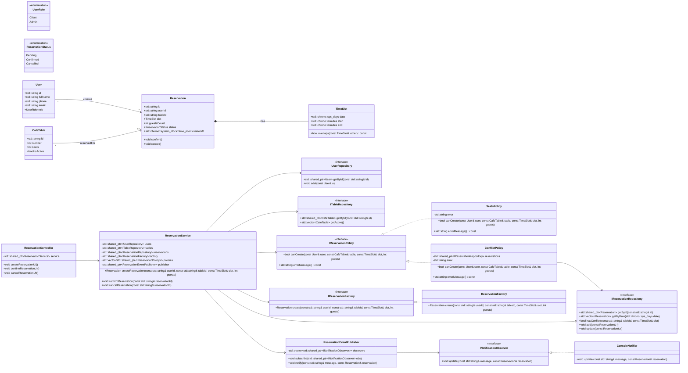

# UML архітектура системи бронювання столиків

```mermaid
classDiagram
direction LR

class UserRole {
  <<enumeration>>
  Client
  Admin
}

class ReservationStatus {
  <<enumeration>>
  Pending
  Confirmed
  Cancelled
}

class User {
  +std::string id
  +std::string fullName
  +std::string phone
  +std::string email
  +UserRole role
}

class CafeTable {
  +std::string id
  +int number
  +int seats
  +bool isActive
}

class TimeSlot {
  +std::chrono::sys_days date
  +std::chrono::minutes start
  +std::chrono::minutes end
  +bool overlaps(const TimeSlot& other) const
}

class Reservation {
  +std::string id
  +std::string userId
  +std::string tableId
  +TimeSlot slot
  +int guestsCount
  +ReservationStatus status
  +std::chrono::system_clock::time_point createdAt
  +void confirm()
  +void cancel()
}

User "1" --> "0..*" Reservation : creates
CafeTable "1" --> "0..*" Reservation : reservedFor
Reservation *-- TimeSlot : has

class IUserRepository {
  <<interface>>
  +std::shared_ptr~User~ getById(const std::string& id)
  +void add(const User& u)
}

class ITableRepository {
  <<interface>>
  +std::shared_ptr~CafeTable~ getById(const std::string& id)
  +std::vector~CafeTable~ getActive()
}

class IReservationRepository {
  <<interface>>
  +std::shared_ptr~Reservation~ getById(const std::string& id)
  +std::vector~Reservation~ getByDate(std::chrono::sys_days date)
  +bool hasConflict(const std::string& tableId, const TimeSlot& slot)
  +void add(const Reservation& r)
  +void update(const Reservation& r)
}

class IReservationPolicy {
  <<interface>>
  +bool canCreate(const User& user, const CafeTable& table, const TimeSlot& slot, int guests)
  +std::string errorMessage() const
}

class SeatsPolicy {
  -std::string error
  +bool canCreate(const User& user, const CafeTable& table, const TimeSlot& slot, int guests)
  +std::string errorMessage() const
}

class ConflictPolicy {
  -std::shared_ptr~IReservationRepository~ reservations
  -std::string error
  +bool canCreate(const User& user, const CafeTable& table, const TimeSlot& slot, int guests)
  +std::string errorMessage() const
}

IReservationPolicy <|.. SeatsPolicy
IReservationPolicy <|.. ConflictPolicy
ConflictPolicy --> IReservationRepository

class IReservationFactory {
  <<interface>>
  +Reservation create(const std::string& userId, const std::string& tableId, const TimeSlot& slot, int guests)
}

class ReservationFactory {
  +Reservation create(const std::string& userId, const std::string& tableId, const TimeSlot& slot, int guests)
}

IReservationFactory <|.. ReservationFactory

class INotificationObserver {
  <<interface>>
  +void update(const std::string& message, const Reservation& reservation)
}

class ReservationEventPublisher {
  -std::vector~std::shared_ptr~INotificationObserver~~ observers
  +void subscribe(std::shared_ptr~INotificationObserver~ obs)
  +void notify(const std::string& message, const Reservation& reservation)
}

class ConsoleNotifier {
  +void update(const std::string& message, const Reservation& reservation)
}

INotificationObserver <|.. ConsoleNotifier
ReservationEventPublisher --> INotificationObserver

class ReservationService {
  -std::shared_ptr~IUserRepository~ users
  -std::shared_ptr~ITableRepository~ tables
  -std::shared_ptr~IReservationRepository~ reservations
  -std::shared_ptr~IReservationFactory~ factory
  -std::vector~std::shared_ptr~IReservationPolicy~~ policies
  -std::shared_ptr~ReservationEventPublisher~ publisher
  +Reservation createReservation(const std::string& userId, const std::string& tableId, const TimeSlot& slot, int guests)
  +void confirmReservation(const std::string& reservationId)
  +void cancelReservation(const std::string& reservationId)
}

ReservationService --> IUserRepository
ReservationService --> ITableRepository
ReservationService --> IReservationRepository
ReservationService --> IReservationFactory
ReservationService --> IReservationPolicy
ReservationService --> ReservationEventPublisher

class ReservationController {
  -std::shared_ptr~ReservationService~ service
  +void createReservationUI()
  +void confirmReservationUI()
  +void cancelReservationUI()
}

ReservationController --> ReservationService
```
